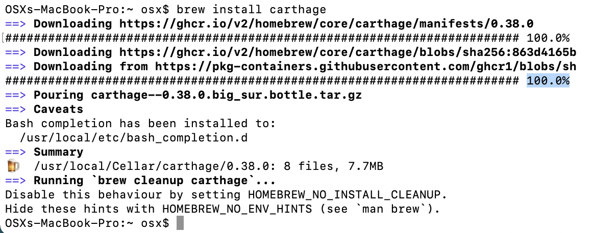
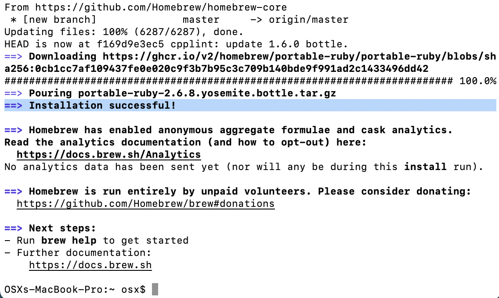
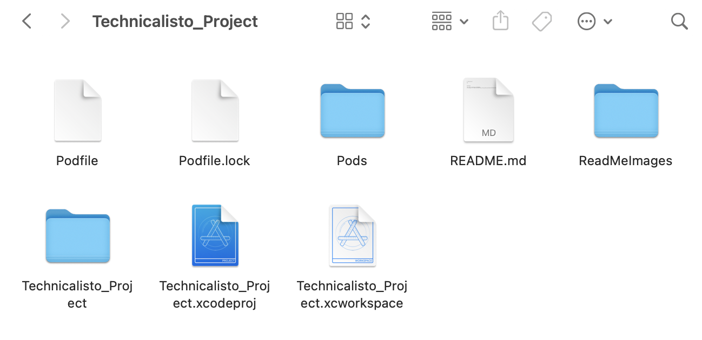
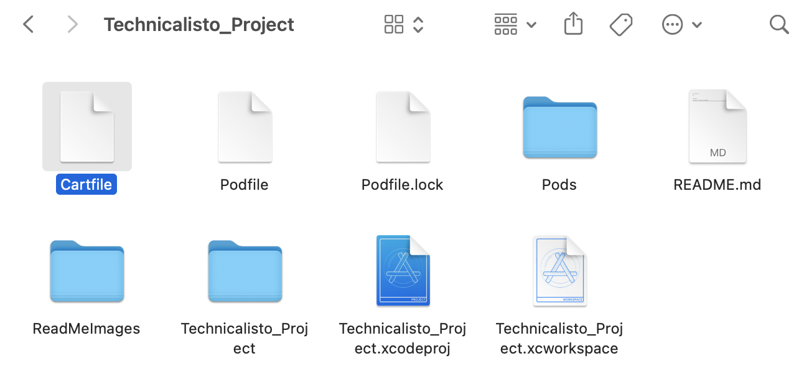
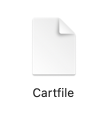
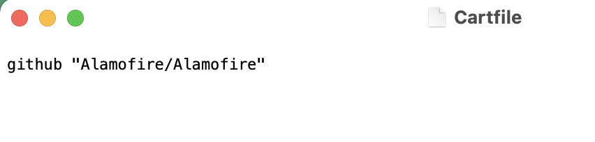
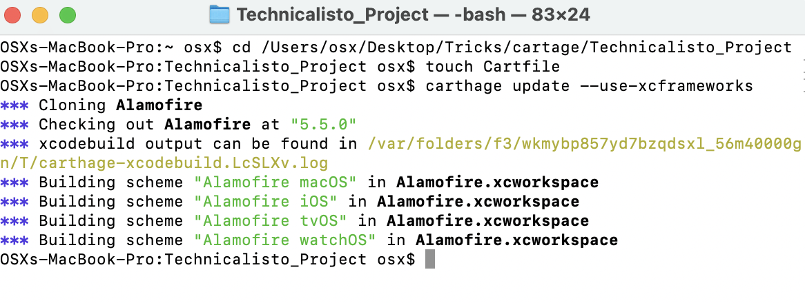
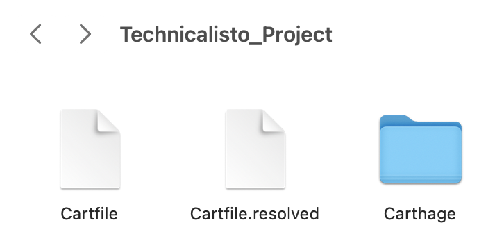
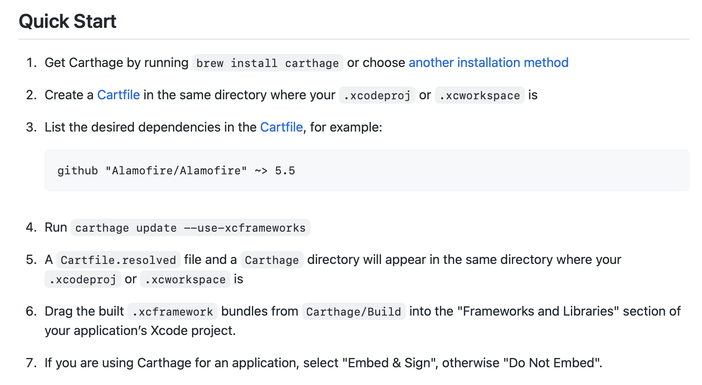
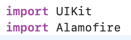

# Technicalisto

## How to install library using Carthage at the first time which has pod files By Steps

### Pod

```
0. Write in Terminal cd (Your_Project_path)

1. pod init

2. pod install

3. Open open XCode project from " .xcworkspace "
```

### Cartage 

0. Definition

```
From the GitHub repository’s main page for Carthage:

Carthage is intended to be the simplest way to add frameworks to your Cocoa application… Ultimately, we created Carthage because we wanted the simplest tool possible—a dependency manager that gets the job done without taking over the responsibility of Xcode, and without creating extra work for framework authors.

```

## install cartage by Carthage.pkg

1. Install cartage 

1.1 Installer: Download and run the Carthage.pkg file for the latest [@release](https://github.com/Carthage/Carthage/releases)

2. In terminal run & write password // for certain no error

```
sudo chown -R $(whoami) /usr/local/*
```

3. Get Carthage by running in terminal

```
brew install carthage 
```

you shoud get this if not or get command not found or error try to install cartage in another way

' like this Image '



## install cartage by Homebrew

3.1 If has still error in step 3 try another way for install like using "Homebrew" write this in terminal & return to step 3 again

```
/bin/bash -c "$(curl -fsSL https://raw.githubusercontent.com/Homebrew/install/master/install.sh)"
```

' like this Image '


Result of step 3.1

' like this Image '



4. Write in Terminal cd (Your_Project_path)

5. Create a Cartfile & open project file to show

This is project folder before this step

' like this Image '



5.1 Run this in terminal 

```
touch Cartfile
```

Project folder After this step

' like this Image '



6. Open created Cartfile this 

' like this Image '



6.1 And write in this file your dependencies you need like this & Save

```
github "Alamofire/Alamofire"
```

' like this Image '



7. Run this in terminal to install

```
carthage update --use-xcframeworks
```

' like this Image '



In Project file you can find 

' like this Image '



Note : we will follow instruction of [@Carthage Documentaion](https://github.com/Carthage/Carthage) in details .

' like this Image '



8. Drag the built .xcframework bundles from Carthage/Build into the "Frameworks and Libraries" section of your application’s Xcode project.

8.1 Open project target

8.2 Build Phases

8.3 Open Link Binary with library

8.3 Click Plus

8.4 Add Other

8.5 Select your Project path -> Cartage Folder -> Build Folder -> select framework.xcframework you need

9. Try in ViewController to import your library & Run your Project if Build successfully then you Done.

' like this Image '



### Thanks

This app is inspired by Aya Baghdadi”
and copyright for [@Technicalisto](https://www.youtube.com/channel/UC7554uvArdSxL4tlws7Wf8Q)
